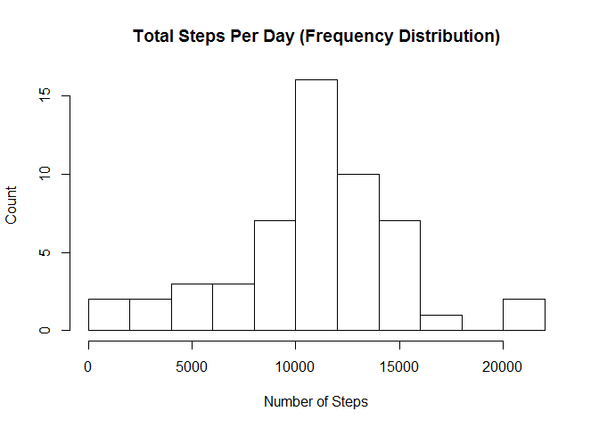
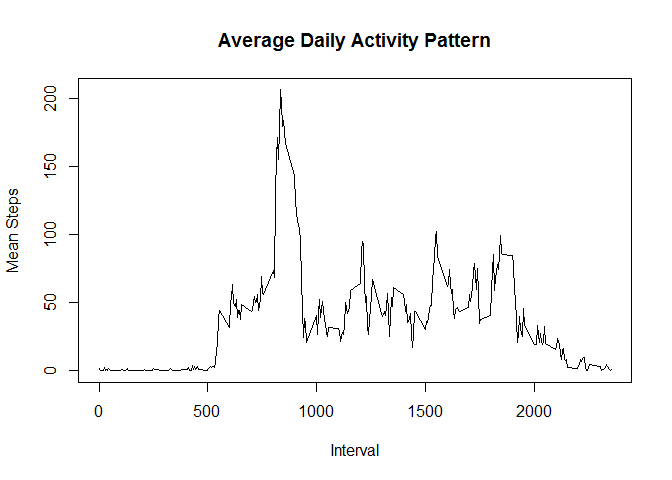
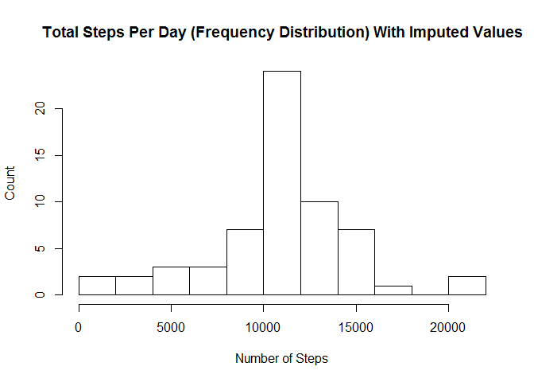

## Setting up required libraries

Before proceeding further, we will install and load required R libraries.
In this case, plyr is needed.


```r
if (!require("plyr")) {
  install.packages("plyr", repos="http://cran.rstudio.com/") 
  library("plyr")
}
```
## Loading and preprocessing the data

Here, we do the following:

- unzip the provided zip file (activity.zip) containing the data;
- load the CSV;
- convert the dates in the data frame to explicit date (POSIXlt) objects.


```r
unzip(zipfile=path.expand("activity.zip"),overwrite=TRUE)
activity_data <- read.csv("activity.csv",stringsAsFactors = FALSE)
activity_data$date <- as.POSIXlt(activity_data$date,format="%Y-%m-%d")
```


## What is mean total number of steps taken per day?

First, we use plyr (ddply) to get the sum of steps taken each day.


```r
activity_data.sum_by_day <- ddply(activity_data,.(date),summarize,total_steps = sum(steps))
```

Next, we make a histogram of the total number of steps taken each day.

```r
hist(activity_data.sum_by_day$total_steps,breaks=10,main="Total Steps Per Day (Frequency Distribution)",ylab="Count",xlab="Number of Steps")
```

 

Finally, we compute the overall mean and median number of steps taken per day.

```r
mean_steps_per_day = mean(activity_data.sum_by_day$total_steps,na.rm=TRUE)
median_steps_per_day = median(activity_data.sum_by_day$total_steps,na.rm=TRUE)
```

The mean steps per day is 1.0766189 &times; 10<sup>4</sup>.

The median steps per day is 10765.


## What is the average daily activity pattern?

First, for each time interval, we average the number of steps taken across all days.  (We also tidy the data frame by moving the interval data to the index column.)

```r
activity_data.mean_by_interval <- ddply(activity_data,.(interval),summarize,mean_steps = mean(steps,na.rm=TRUE))
rownames(activity_data.mean_by_interval) <- activity_data.mean_by_interval$interval
```

Next, we plot the time series of the mean steps per interval.  

```r
plot(x=activity_data.mean_by_interval,type="l",main="Average Daily Activity Pattern",xlab="Interval",ylab="Mean Steps")
```

 

Finally, we sort the data frame by mean steps, decreasing.

```r
activity_data.mean_by_interval.sorted <- activity_data.mean_by_interval[order(activity_data.mean_by_interval$mean_steps,decreasing=TRUE),]
```
Interval 835 has the largest mean number of steps (206.1698113) across all days.

## Imputing missing values

There are 2304 missing values in the activity dataset.

To fix the missing values, we will replace them with the average for the time interval.  This is done by merging the activity data with the data frame containing the interval averages, and then replacing "steps" with "mean_steps" where "steps" is NA.


```r
activity_data.no_na <- merge(activity_data, activity_data.mean_by_interval, by="interval")

activity_data.no_na <- mutate(activity_data.no_na,steps=ifelse(is.na(steps), mean_steps, steps))
```

There are now 0 missing values in the activity dataset.

Now we recompute the total steps per day, the resulting histogram, and the overall mean and median with missing values imputed.  

```r
activity_data.sum_by_day.no_na <- ddply(activity_data.no_na,.(date),summarize,total_steps = sum(steps))

hist(activity_data.sum_by_day.no_na$total_steps,breaks=10,main="Total Steps Per Day (Frequency Distribution) With Imputed Values",ylab="Count",xlab="Number of Steps")
```

 

```r
mean_steps_per_day.no_na = mean(activity_data.sum_by_day.no_na$total_steps)
median_steps_per_day.no_na = median(activity_data.sum_by_day.no_na$total_steps)
```

The mean steps per day with imputed NA values is 1.0766189 &times; 10<sup>4</sup>, as compared to 1.0766189 &times; 10<sup>4</sup>.

The median steps per day with imputed NA values is 1.0766189 &times; 10<sup>4</sup>, as compared to 10765.

## Are there differences in activity patterns between weekdays and weekends?

(I was not able to complete this last portion, but below is my initial work.)
We will add new columns to identify whether or not the data was collected on a weekday or weekend.

```r
activity_data.no_na.weekdays <- activity_data.no_na

activity_data.no_na.weekdays$day <- weekdays(activity_data.no_na.weekdays$date)
activity_data.no_na.weekdays$day_type <- ifelse(activity_data.no_na.weekdays$day == "Saturday" || activity_data.no_na.weekdays$day == "Sunday","weekend","weekday")

#activity_data.no_na.weekdays$day_type <- as.factor(activity_data.no_na.weekdays$day_type)
```
